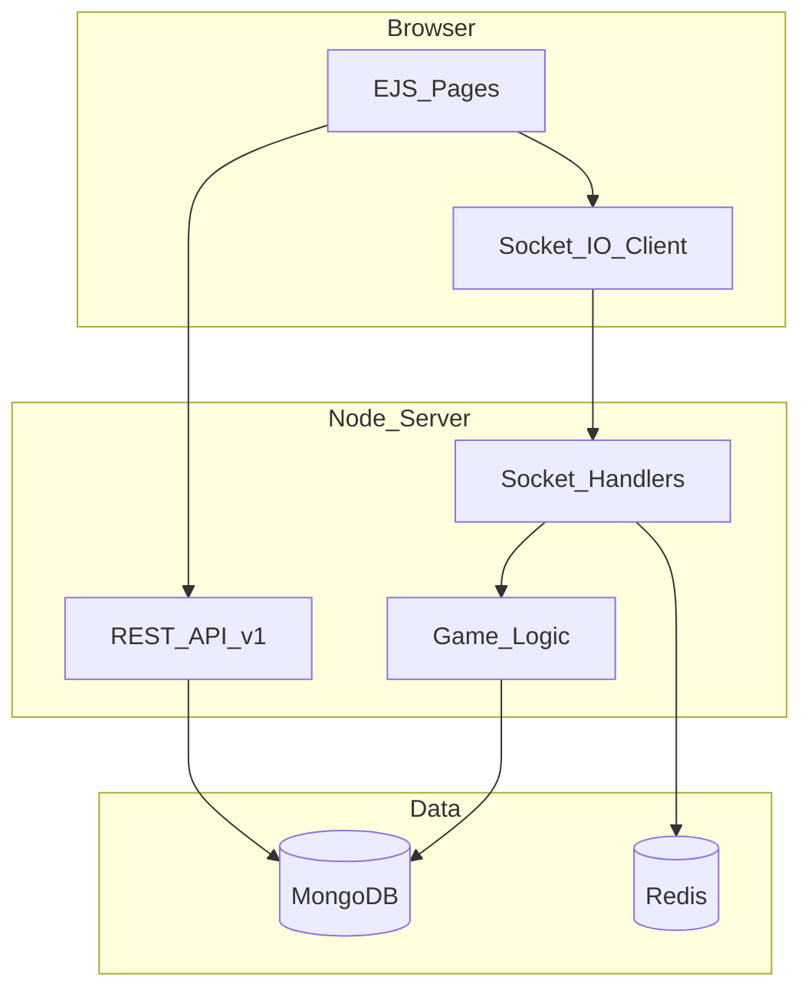

# Chess.com Clone

A production-oriented real-time multiplayer chess platform with ELO matchmaking, bot AI (minimax), game persistence, REST API with OpenAPI docs, Docker, CI, and Redis-backed Socket.IO scaling.

## Features

- Real-time multiplayer chess over Socket.IO with server-authoritative move validation
- ELO-based matchmaking (±200 rating window) and color preference
- Bot games with difficulty tiers and personalities (minimax + alpha-beta)
- Reconnect within 30s grace window after disconnect/refresh
- JWT authentication (registered users + guest sessions)
- Game persistence in MongoDB with PGN export via API
- Server-rendered EJS UI with full chess board, timers, and chat
- REST API v1 + Swagger UI at `/api/v1/docs`
- Health/readiness probes, structured logging, rate limiting, Helmet

## Tech Stack

| Layer | Stack |
|-------|-------|
| Frontend | EJS, Vanilla JavaScript, CSS |
| Backend | Node.js, Express, Socket.IO |
| Data | MongoDB (Mongoose), Redis (Socket.IO adapter) |
| Chess | chess.js |
| Ops | Docker, GitHub Actions, Pino |

## Architecture



## Quick Start

### Prerequisites

- Node.js 20+
- MongoDB
- Redis (optional but recommended)

### Local development

```bash
cp .env.example .env
npm install
npm run dev
```

Open http://localhost:3000

Use `NODE_ENV=development` in `.env` for local HTTP (required for auth cookies).

### Docker (one command)

```bash
docker compose up --build
```

## Scripts

| Script | Description |
|--------|-------------|
| `npm start` | Production server |
| `npm run dev` | Backend with nodemon |
| `npm test` | Jest test suite |
| `npm run lint` | ESLint |
| `npm run format` | Prettier |

## API

Base URL: `/api/v1`

| Endpoint | Description |
|----------|-------------|
| `POST /auth/register` | Register |
| `POST /auth/login` | Login |
| `POST /auth/guest` | Guest session |
| `POST /auth/logout` | Logout |
| `GET /users/me` | Current user |
| `GET /games` | Completed games (paginated) |
| `GET /games/:id` | Game with PGN |
| `GET /leaderboard` | Top ratings |
| `GET /stats` | Platform stats |
| `GET /health` | Liveness |
| `GET /ready` | Readiness (MongoDB) |

Interactive docs: **http://localhost:3000/api/v1/docs**

## Environment Variables

See [.env.example](.env.example). Key variables:

| Variable | Description |
|----------|-------------|
| `MONGODB_URI` | MongoDB connection string |
| `REDIS_URL` | Redis URL for Socket.IO adapter |
| `JWT_SECRET` | JWT signing secret |
| `PORT` | HTTP port (default 3000) |
| `NODE_ENV` | Use `development` locally, `production` when deployed |

## Deployment

### Railway / Render / Fly.io

1. Set environment variables from `.env.example`
2. Use managed MongoDB (Atlas) and Redis (Upstash)
3. Build command: `npm install`
4. Start command: `npm start`

### Docker

```bash
docker compose up --build
```

## Design Decisions

- **Server-side validation:** All moves validated with chess.js on the server; clients cannot cheat.
- **Redis adapter:** Enables horizontal scaling of Socket.IO across multiple Node instances.
- **userId-based reconnect:** Socket IDs change on refresh; games are keyed by user ID for resume.
- **In-memory active games:** Fast move processing; MongoDB stores completed games and audit trail.

## Resume Bullet (example)

> Built a real-time multiplayer chess platform (Node.js, Socket.IO, Redis, MongoDB) with ELO matchmaking, server-authoritative move validation, bot AI (minimax), game persistence, automated tests, and CI/CD via GitHub Actions. Deployed with Docker.

## License

ISC
